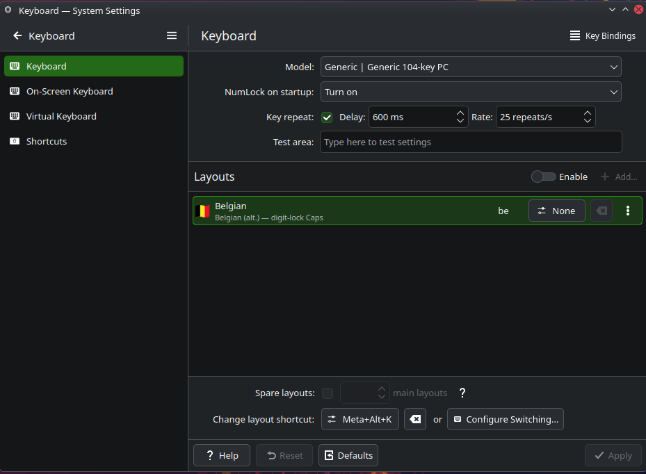

# belgiankeyboardcapsfix

**Caps Lock that locks the digits row on Belgian AZERTY keyboards — the way Windows does it.**

## The problem

On a Belgian AZERTY layout, the keys with 2 levels (for example ù and %) and especially the digits row is on the *shifted* level: `&é"'(§è!çà` unshifted, `1234567890` shifted. To type a phone number, a date or a bank account, you hold Shift the whole time. On Windows, the behaviour lets you press **Caps Lock** and have the keys with two levels lock to the upper row while everything else stays normal. I never found a fix that worked right, so I did one myself with Claude Code (Vibecoding mostly documentation and inline code comments and most of the repetitive work)

The 2 existing Linux workarounds I found were bad:

- **"Shift Lock"** in GNOME Tweaks simulates a held Shift key. Side effect: Caps + click in LibreOffice Calc fires range-multiselect, Caps + drag in Dolphin selects files. Anyone who does office work has cursed it.
- **`caps:digits_row_independent_lock`** (the upstream XKB option, "Shift + Caps locks the digits…") needs Shift+Caps, not Caps alone — and on current Plasma 6.x it doesn't even work: the compiled keymap leaves Caps bound to a modifier it can't reach.

## The fix

This tool patches `/usr/share/X11/xkb/symbols/be` so the **Belgian (alt.)** variant uses a key type that flips its level when Caps Lock is toggled, and rewires Caps Lock itself to atomically lock the correct modifiers.

Press Caps Lock alone:

| Without fix | With fix |
|-------------|----------|
| `&É"'(` | `12345` |
| Shift + click does multiselect | Shift is untouched — no side effects |

KDE System Settings → Keyboard → Layouts will show the variant as **"Belgian (alt.) — digit-lock Caps"** so you can tell at a glance the fix is applied:



## Install

```bash
git clone https://github.com/therif0/belgiankeyboardcapsfix.git
cd belgiankeyboardcapsfix
./install.sh
```

Asks for your sudo password (the patch is to a system file). Log out and back in.

## Uninstall

```bash
./uninstall.sh
```

Restores the original files from backups. Log out and back in.

## What's tested

- Fedora 44, KDE Plasma 6.6.5 on Wayland, `xkeyboard-config 2.47`, layout `be` variant `oss` (Belgian alt.).

Other AZERTY layouts (`fr(oss)`, `be(basic)`, etc.) aren't covered yet — the patch is variant-specific. PRs welcome.

## What gets touched

Three system files, each with a `.azerty-caps-fix.orig` backup next to it:

- `/usr/share/X11/xkb/symbols/be` — the actual keymap behaviour.
- `/usr/share/X11/xkb/rules/evdev.xml` — the variant description shown in KDE Settings.
- `/usr/share/X11/xkb/rules/evdev.lst` — same, for `setxkbmap` listings.

No systemd service, no per-user config, no daemon. Just three patched files. An `xkeyboard-config` package update will revert them; re-run `./install.sh`.

## License

MIT — see `LICENSE`.
